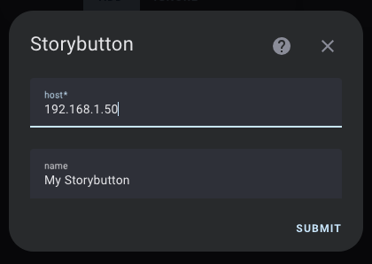
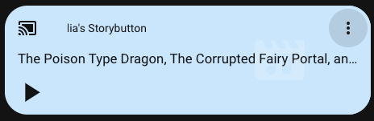

# Storybutton integration for Home Assistant

The [Storybutton](https://storybutton.com/) is a pretty sweet little podcast device for kids.

This Home Assistant integration allows you to control playback and volume on your devices, as well as show what's playing.

## Setup

- Install from HACS

- Go to your integrations dashboard and click "Add Integration"

- Use the IP address or hostname of your Storybutton

That's it! The device is now setup as a media player.

# TODO

- Validation for config flow